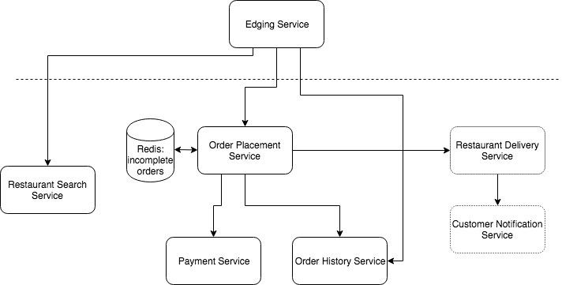

# Specification

1. search restaurant by name

2. order: item, quantity, note about diet, delivery address

3. access for orders (status: not payed, placed, delivered)

4. payment: credit card credentials -> payment ID, timestamp, estimated time

# Need Analysis
## Scenarios
1. the user searches restaurant by name and get menu
2. the user orders by specifying items and according quantities (json)
3. the user pays for the order successfully
4. order is sent to designated restaurant
5. order is being prepared, notify the order history
6. order is on the way, notify both the user and the history

## workflow
order placement -> order completion (permanent storage) 
-> preparation completion (possibly cancel) -> delivery completion (possibly cancel)

## Failure points
- payment failed
- order canceled by the restaurant

## Domains
1. restaurant info (RDB for restaurant)

2. incomplete order info (Redis for pending orders)

3. payment info (DB for payment history)

4. payed order info (DB for payment history)

# Services (to implement)
1. restaurant search service

2. order placement service

3. order status service

4. edging service (restaurant search, get menus, order, pay)

## Diagram

## Producer/consumer pattern in ...
- order placement -> order history
- order placement -> restaurant delivery

## APIs
### restaurant search service
Path | Method | Description
--- | --- | ---
/restaurants/name/:keyword | GET | search by name
/restaurants/id/:id/menu | GET | get menu from the specific restaurant

### order placement service
Path | Method | Description | Options
--- | --- | --- | ---
/placements/userId/:userId | GET | get the incomplete orders | id-only (bool)
/placements/id/:id | GET | get the info for an incomplete order
/placements | POST | place order; payload: {paymentCredential, order, address}
/orders/userId/:userId | GET | get payed order info

### payment service
Path | Method | Description
--- | --- | ---
/card-verification | POST | card number verification
/payments | POST | make payment; payload: {cardNum, ..., billing}

### restaurant delivery service
Path | Method | Description
--- | --- | ---
/orders/restaurant/:id | POST | place order to the restaurant

### order history
Path | Method | Description
--- | --- | ---
/orders/id/:id | GET | get info about specific order
/orders | POST | add to history
/orders/id/:id | PUT | update (status of order)

# Post
## important factors out of 12
+ explicit dependencies
+ store config in the environment
+ treat backing services as attached resources
+ keep dev, staging, prod as similar as possible
+ treat logs as event streams

## features for micro-service architecture
+ each team gets one database and one service
+ shared caches are platform provided services that are shared for consistency

